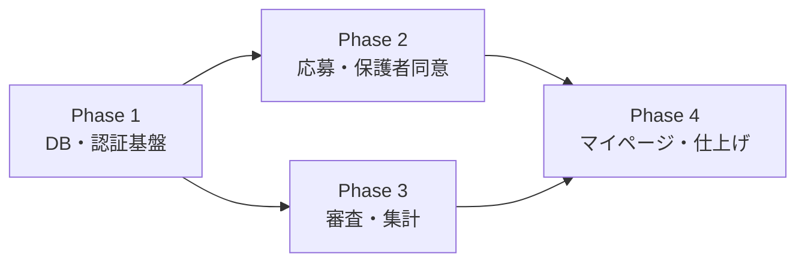

# 北区こどもプログラミングコンテスト 応募・審査システム
`kids-code-contest`

---

## 1. 技術スタック

小中学生向けのシンプルなUI、リアルタイムな集計機能、外部連携（Google OAuth、メール送信）を効率良く実現するための推奨構成です。

| 領域 | 選定技術 | 選定理由・特徴 |
| :--- | :--- | :--- |
| **コード管理** | **GitHub**| ・開発の中心となるツール |
| **フロントエンド** | **Next.js** (React)<br>**Tailwind CSS** <br>daisyUI| ・応募者・保護者・審査員画面を単一リポジトリで効率よく開発可能<br>・Markdownの入力/表示ライブラリが豊富 |
| **バックエンド / DB** | **Supabase**<br>(PostgreSQL / Auth) | ・**認証**: Google OAuth / メール認証（保護者用ワンタイムURL）を安全に実装<br>・**DB**: PostgreSQLによる強力なリアルタイム集計 |
| **ストレージ** | **Cloudflare R2** | ・動画（MP4）やサムネイル（PNG/JPG）のアップロード管理<br>・エグレス（データ転送）コストを低く抑えられる |
| **メール配信** | **Resend** | ・保護者宛の同意リクエスト等のトランザクションメール到達率が高い<br>・API連携による即時送信が可能 |

> 💡 **インフラ連携**: GitHubを軸に **Vercel** / **Supabase** / **Cloudflare** を自動デプロイ連携。

---

## 2. 段階的実装ロードマップ

コア機能から順番に構築し、テストを進めるアプローチをとります。



* **Phase 1: DB・認証基盤** — Supabaseでのスキーマ設計、Google OAuth / メール認証の実装
* **Phase 2: 応募・保護者同意** — 作品投稿フォーム、Cloudflare R2連携、同意確認フロー
* **Phase 3: 審査・集計** — 審査員用ダッシュボード、リアルタイムスコア集計機能
* **Phase 4: マイページ・仕上げ** — 応募履歴確認、デザイン調整、最終動作テスト

```
